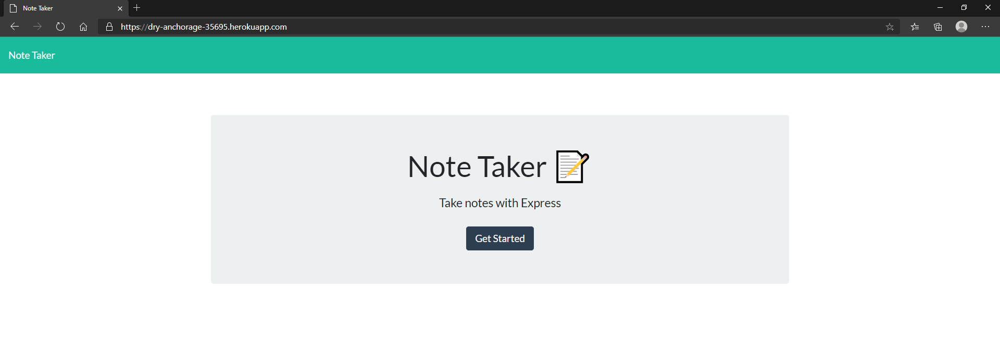
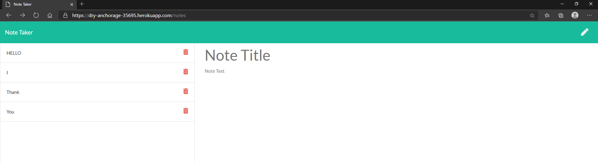
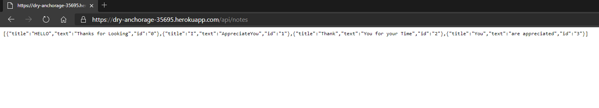

# takeNotes
Note taking application

## Description

Access / Delete / Edit Notes with the use of Node Express backend using JSON data and the Node file system module.

## Install

Clone repo, Here. [dohmr / takeNotes Repo](https://github.com/dohmr/takeNotes)

Open via Code Editor. 

## USAGE

Install npm dependencies. Run file ```node server.js``` in terminal.
Either view in localhost, or view via Heroku host [HEROKU / Note-Taker Application](https://dry-anchorage-35695.herokuapp.com/)

## Collaboration

HTML / CSS Provided

Node.js NPM modules EXPRESS.js


## Screens

LANDING 
;

Saved Notes
;

JSON
;


## Questions

[Shawn Yandall : LinkedIn](https://www.linkedin.com/in/shawn.yandall/)

[Shawn Yandall : Github](https://github.com/dohmr/)
